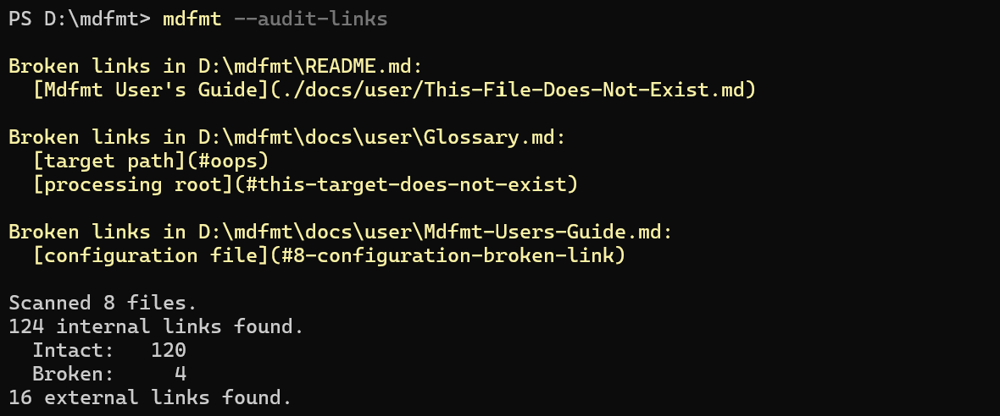

# Mdfmt User's Guide

<!--BEGIN_TOC-->
- [Mdfmt User's Guide](#mdfmt-users-guide)
  - [1. Introduction](#1-introduction)
  - [2. Getting Started](#2-getting-started)
    - [2.1. Downloading And Installing](#21-downloading-and-installing)
    - [2.2. Checking The Version](#22-checking-the-version)
    - [2.3. Displaying Help](#23-displaying-help)
  - [3. md File Extension](#3-md-file-extension)
  - [4. Basic Usage Overview](#4-basic-usage-overview)
  - [5. Options And Target Path](#5-options-and-target-path)
    - [5.1. Environment](#51-environment)
    - [5.2. Formatting Options](#52-formatting-options)
      - [5.2.1. Flavor](#521-flavor)
      - [5.2.2. Heading Numbers](#522-heading-numbers)
      - [5.2.3. Line Numbering Threshold](#523-line-numbering-threshold)
      - [5.2.4. Newline Strategy](#524-newline-strategy)
      - [5.2.5. TOC Threshold](#525-toc-threshold)
    - [5.3. Flags](#53-flags)
      - [5.3.1. Audit Links](#531-audit-links)
      - [5.3.2. Flavor Xdoc](#532-flavor-xdoc)
      - [5.3.3. Recursive](#533-recursive)
      - [5.3.4. Verbose](#534-verbose)
      - [5.3.5. Help](#535-help)
      - [5.3.6. Version](#536-version)
    - [5.4. Target Path](#54-target-path)
  - [6. Output](#6-output)
    - [6.1. Errors And Warnings Always Shown](#61-errors-and-warnings-always-shown)
    - [6.2. Non-Verbose Output](#62-non-verbose-output)
    - [6.3. Verbose Output](#63-verbose-output)
    - [6.4. Example of Verbose Output](#64-example-of-verbose-output)
  - [7. Maintaining Cross-Document Links](#7-maintaining-cross-document-links)
  - [8. Configuration](#8-configuration)
    - [8.1. Configuration File Names](#81-configuration-file-names)
    - [8.2. How Configuration Files Are Located](#82-how-configuration-files-are-located)
    - [8.3. Configuration File Format](#83-configuration-file-format)
    - [8.4. Loading Multiple Configuration Files](#84-loading-multiple-configuration-files)
    - [8.5. Options Inheritance](#85-options-inheritance)
      - [8.5.1. Example: Deciding How To Format The Glossary](#851-example-deciding-how-to-format-the-glossary)
  - [9. Return Value](#9-return-value)
<!--END_TOC-->

## 1. Introduction

Mdfmt is a command line interface (CLI) for Markdown formatting.  Able to operate on individual Markdown files and on directory structures containing many Markdown files, it automates maintenance of heading numbers, in-document links, cross-document links, table of contents, line numbering of fenced code blocks, consistent newlines, etc.  Mdfmt is designed to help with both simple use cases where only one kind of formatting is required, and with more complex use cases involving multiple target Markdown rendering environments with different formatting needs.

See also this [Glossary](./Glossary.md), which defines the language used to talk about Mdfmt.

## 2. Getting Started

### 2.1. Downloading And Installing

A version of Mdfmt is released as a collection of `.zip` files, each `.zip` file targeting a different combination of _runtime_ and _deployment type_.

- _Runtime_ indicates an operating system and processor architecture.
- _Deployment type_ is either _self-contained_ or _framework-dependent_, with respect to a specific version of .NET.
  - _Self-contained_ means that the release includes the .NET runtime.
  - _Framework-dependent_ means that the release does not include the .NET runtime, so the runtime needs to be installed separately.

Releases can be downloaded from the [releases](https://github.com/steinar-flatland/mdfmt/releases) page.  Within a release, each `.zip` file is named according to this template:

```console
mdfmt_{version}_{runtime}_{deploymentType}.zip
```

Examples of `.zip` file names in a release:

- mdfmt_1.7.0_linux-x64_framework-dependent-net8.0.zip
- mdfmt_1.7.0_linux-x64_self-contained-net8.0.zip
- mdfmt_1.7.0_win-x64_framework-dependent-net8.0.zip
- mdfmt_1.7.0_win-x64_self-contained-net8.0.zip

To download and install Mdfmt:

- Go to the [releases](https://github.com/steinar-flatland/mdfmt/releases) page.  The latest release is on top, and you can scroll down to see earlier releases.
- Download the `.zip` file for the desired runtime and deployment type.
- Unzip the `.zip` file, which creates a directory named `mdfmt`.
- Ensure that the `mdfmt` directory is on your path.

### 2.2. Checking The Version

Run the software for the first time from a shell or command prompt:

```console
mdfmt --version
```

It should print out a version number that looks something like this:

```console
1.2.3
```

This version number is managed according to the guidelines of [Semantic Versioning 2.0.0](https://semver.org/spec/v2.0.0.html).  Of the three numbers, the leftmost is the MAJOR number, the middle is the MINOR number, and the rightmost is the PATCH number.

- MAJOR version means a breaking change.
- MINOR version means new functionality added in a backward compatible way.
- PATCH version means a backward compatible fix to pre-existing functionality.

### 2.3. Displaying Help

```console
mdfmt --help
```

Displays:

1. Semantic version number.
2. Copyright notice.
3. Licensing information.
4. Link to this user's guide.
5. Description of command line arguments and positional parameter.  These are described further in [Options And Target Path](#5-options-and-target-path).

If you are new to Mdfmt, it is a good idea to read the `mdfmt --help` output in consultation with this [Glossary](Glossary.md) that describes the ubiquitous language.

## 3. md File Extension

Mdfmt will only process and update Markdown files where the file name ends in `.md`

Attempting to apply Mdfmt to a file that does not end with the `.md` extension leads to the following error message:

```console
File cannot be processed because it is not a .md file
```

This behavior is a design choice to keep the application of the tool focused and to prevent erroneous editing.  Hopefully this is not inconvenient for users of the tool.  If you have a use case that requires more flexibility regarding the file extension, please [reach out](../../README.md#4.-contact).

## 4. Basic Usage Overview

This section introduces the basic usage of Mdfmt, utilizing formatting instructions passed in on the command line only, without the use of configuration files.  See also the section on [Configuration](#8-configuration), which becomes convenient when you always want to apply certain formatting options to certain files underneath a root folder.

Basic usage:  Mdfmt is a CLI that you call from a command prompt or shell.  An Mdfmt command follows this basic template:

```console
mdfmt {options} {target-path}
```

The basic idea is that the specified `{options}` indicate formatting to be done to either a single Markdown file specified as the `{target-path}`, or to all the Markdown files contained in a directory specified as the `{target-path}`.

If an explicit target path is omitted from the command line, it defaults to the current working directory, i.e., the directory that is the current one in the shell when Mdfmt is called.

**Example:**

```console
mdfmt --heading-numbers 1. ./My-Document.md
```

The above command adds heading numbers like the ones that this [Mdfmt User's Guide](#mdfmt-users-guide) contains, to the headings of a Markdown file named `My-Document.md` in the current directory.  The formatting option `--heading-numbers 1.` means that heading numbers should be added (this is done idempotently), and each number should end with a dot.  The first section will be numbered `1.` and if it has subsections, they will be numbered `1.1.`, `1.2.`, etc.  If there are already heading numbers but they are incorrect or have gaps, the existing heading numbers will be corrected and any missing ones added.

**Example:**

```console
mdfmt --heading-numbers none --flavor Common -r /my-project/docs
```

The above command both removes heading numbers and assures that the `Common` [slugification](./Glossary.md#slug) algorithm is used on all in-document links so that they work on common platforms including GitHub and VS Code Markdown preview.  In this example, the target path is a directory (the `docs` folder of a project called `my-project`), and the `-r` option applies the specified formatting options to all Markdown files that are either directly in the `docs` folder or in a subfolder that is a descendant of `docs`.

For more information about available options, run `mdfmt --help`.  For a deeper discussion, see the next section on [Options And Target Path](#5-options-and-target-path) below.

## 5. Options And Target Path

This section discusses the command line options and target path that are passed to Mdfmt on the command line.

To best understand this section, be familiar with the [Basic Usage Overview](#4-basic-usage-overview) above, and what is meant by the terms _options_ and _target path_ in the context of Mdfmt usage.

A few words about how each option is described in the subsections below below:

- Long name - The long name of an option, for specifying it on the command line, e.g. `--recursive`.  All options have a long name.  
- Short name - A shortened form of the long name, e.g. `-r`.  Many, but not all options have a short name.  When an option has both a long name and a short name, they are synonyms, and which one you use is a matter of style.

  > Terminology note:  Collectively, long names and short names are referred to simply as _names_ of options.

- Type - The type of option.  The different types are:
  - flag - an option that is specified with a name only and without another token to provide a value.  A flag is used to pass a boolean value to an option of the program in the following way:  When the option's name is provided, the value passed to the option is `true`.  When the option's name is not provided, the value pased to the option is `false`.

    > flag is the only type where the name of the option is not followed by another token to provide the value.  All the other types do require a value after the name, for example `-h 1`

  - enumeration - an option that takes as input one value from a list of possible values.
  - nonnegative int - an option that takes as input an integer that is `>= 0`.  Passing a value that is out of range results in an error message.
  - string - a string of characters.
- Description - A description of the effect of the option; what it does; how it works.
- Values - Describes the valid values of the Type.  For an enumeration, lists the values and explains what each one means.
- Default - Some options have a default value, which is the value that the option assumes when it is omitted from the command line.  When there is no default, omission of the option from the command line leads to a `null`/missing value, and the Mdfmt program reacts to this either by providing an error message if the omission is unacceptable, or by implementing a default behavior if the omission is acceptable.
- Configuration file key - When using configuration files (see the section, [Configuration](#8-configuration)), provides the key to use to identify this formatting option in configuration files.  Configuration file key is only provided for [formatting options](#52-formatting-options), not for other command line options.

Options are described in the subsections below.

### 5.1. Environment

- Long name: **`--environment`**
- Short name: **`-e`**
- Type: string
- Description: Optional environment name affecting configuration.  When specified, Mdfmt requires the presence of a configuration file named `mdfmt.{environment}.json`, where `{environment}` is replaced by the value passed to this option.
- Values: Use a string with characters that are valid to use as part of file names in your operating system's file system.
- Default: `null`.  If this option is omitted, Mdfmt does not look for an environment-specific configuration file.

For full details on the configuration system, see [Configuration](#8-configuration).

### 5.2. Formatting Options

These options are used to specify formatting that Mdfmt should apply to Markdown files targeted by the [target path](#54-target-path) that is specified through the command line (or defaults to current working directory).

#### 5.2.1. Flavor

- Long name: **`--flavor`**
- Short name: **`-f`**
- Type: enumeration
- Description: Sets the [slugification](./Glossary.md#slugification) algorithm used to convert headings to link destinations.  This affects in-document links both in the body and in the table of contents of the document.  See also the related [`--flavor-xdoc`](#532-flavor-xdoc) flag, which can be specified together with `--flavor, -f` to ensure that cross-document links have the indicated flavor.
  - Dependency: If the value of the [`--toc-threshold, -t`](#525-toc-threshold) option `> 0`, then this `--flavor, -f` option is required, to inform the flavor of TOC link destinations.
  - Dependency: If a value is provided for the [`--heading-numbers, -h`](#522-heading-numbers) option, then this `--flavor, -f` option is required, to inform the flavor of link destinations targeting any renumbered headings.
- Values:
  - `Common` - Use a common slugification algorithm that works on multiple platforms including GitHub and VS Code Markdown preview.
  - `Azure` - Use a slugification algorithm that works in Azure DevOps Wiki.
- Default: `null`.  If this option is omitted, in-document links are not updated.
- Configuration file key: `Flavor`

  > If you have a need for another slugification algorithm, it is likely an easy addition to make.  The code has been architected with an interface that can be implemented for more algorithms.  Feel free to [reach out](../../README.md#4.-contact).

#### 5.2.2. Heading Numbers

- Long name: **`--heading-numbers`**
- Short name: **`-h`**
- Type: enumeration
- Description: Whether to include heading numbers and, if so, the style of heading numbers to use.  When Mdfmt applies heading numbers, it looks for new sections and misnumbered headings, adjusting heading numbers throughout the document as needed.  This makes it easy to insert a new section between others:  Just insert a new heading without a heading number and run `mdfmt -h`.  Mdfmt assigns any missing heading number and fixes any other heading numbers that then need adjustment.

  Mdfmt only pays attention to Markdown headings with up to six pound signs (`######`).  Would-be headings with seven or more `#` symbols are ignored by Mdfmt, and it does not manage heading numbers on such lines.

  - Dependency: If a value is provided for this `--heading-numbers, -h` option, then the [`--flavor, -f`](#521-flavor) option is required.  This is because Mdfmt needs to be prepared to patch links that are targeting headings that were renumbered.  Without knowledge of the flavor of slug to produce, updating links would not be possible.

- Values:
  - `none` - Remove heading numbers.
  - `1.` - Include heading numbers that end in a period.  The first section is numbered `1.`, and its children are `1.1.`, `1.2.`, ... etc.  Note that this [Mdfmt User's Guide](#mdfmt-users-guide) document uses the `-h 1.` option.
  - `1` - Include heading numbers that do not end in a period.  The first section is numbered `1`, and its children are `1.1`, `1.2`, ... etc.
- Default: `null`.  If this option is omitted, no changes are made to heading numbers.
- Configuration file key: `HeadingNumbering`

#### 5.2.3. Line Numbering Threshold

- Long name: **`--line-numbering-threshold`**
- Short name: **`-l`**
- Type: nonnegative int
- Description: The minimum number of lines in a fenced code block that triggers inclusion of line numbers, or 0 to ensure no line numbers.
  - When 0: Always assures removal of line numbers from fenced code blocks.
  - When a positive int: If the number of lines in a fenced code block meets or exceeds the threshold, ensures that each line of the code block starts with a 1-based line number, and if the number of lines is below the threshold, ensures removal of the line numbers.
- Default: `null`.  If this option is omitted, Mdfmt does not edit line numbers in fenced code blocks.
- Configuration file key: `LineNumberingThreshold`

#### 5.2.4. Newline Strategy

- Long name: **`--newline-strategy`**
- Short name: _none_
- Type: enumeration
- Description:  Strategy for maintaining newlines.
- Values:
  - `Unix` - Use Unix newlines (`\n`).
  - `Windows` - Use Windows newlines (`\r\n`).
  - `PreferUnix` - Prefer Unix newlines (`\n`).
  - `PreferWindows` - Prefer Windows newlines (`\r\n`).

  The non-preferred options force all newlines to the specified type.

  The preferred options only take effect if the file being processed has a mixture of different kinds of newlines:  Then, all newlines are switched over to the preference, and any new newlines introduced by Mdfmt also follow the preference.  If, the file being processed has only one kind of newline, Mdfmt ignores the preferred option and just continues to use the kind of newline that is already being used.

- Default: `null`.  If this option is omitted, no changes are made to existing newlines, and any new newlines introduced by Mdfmt follow the predominant style of the current file.  (In the event of a tie, Mdfmt uses `\n` for newly added newlines.)
- Configuration file key: `NewlineStrategy`

#### 5.2.5. TOC Threshold

- Long name: **`--toc-threshold`**
- Short name: **`-t`**
- Type: nonnegative int
- Description: The minimum number of headings for which to include a table of contents (TOC).
  - When 0:  Always assures removal of any TOC.
  - When a positive int:  If the number of headings in the document meets or exceeds the threshold, ensures that a TOC is added or updated, and if the number of headings is below the threshold, ensures removal of the TOC.
    - Dependency:  The [`--flavor, -f`](#521-flavor) option is required when the value of `--toc-threshold, -t` > 0, so that TOC generation knows how to make link destinations when generating the table of contents.
- Default: `null`.  If this option is omitted, threshold-based TOC maintenance does not occur; however, a pre-existing TOC can still be maintained if the `-f` option is specified in this case.
- Configuration file key: `TocThreshold`

### 5.3. Flags

#### 5.3.1. Audit Links

- Long name: **`--audit-links`**
- Short name: _none_
- Type: flag
- Description: Whether to perform a link audit, which visits all Markdown files in the processing root recursively, checks all in-document and cross-document links (collectively called _internal_ links to distinguish them from external http and https links), and prints a report to the console about intact and broken links.  This feature is useful for finding and fixing broken links.  When this option is true, Mdfmt generates the report and ignores other options.
- Values: true, false
- Default: false

Here's an example of a link auditing report:



The report shows:

- The name of each file that has broken links, with the offending links indented under each file name.
- A summary showing counts for the following across all files:
  - Number of Markdown files scanned.
  - Number of [internal links](./Glossary.md#internal-link) found, with subtotals for the number of intact and broken links.
  - Number of [external links](./Glossary.md#external-link) found.  (The auditor does not do web crawling; these are not verified.)

If all internal links were intact, the program returns 0 (success) to the shell.  If, on the other hand, there were some broken internal links, then 1 (error) is returned to the shell.  This could be useful for a link auditing stage in a deployment pipleline, to prevent pushing documentation to a developer portal, unless all internal links are intact.

#### 5.3.2. Flavor Xdoc

- Long name: **`--flavor-xdoc`**
- Short name: _none_
- Type: flag
- Description: By default, applying a flavor with [`--flavor, -f`](#521-flavor) updates only in-document links, not cross document links.  This flag, when specified in combination with applying a flavor, augments this default behavior to (1) format cross-document links according to the flavor applied to each file and (2) warn about any unresolvable cross-document links.  The augmented functionality involves only the subset of cross-document links that target specific headings, because these are the only cross-document links that have slugs, and slugs need to be reformatted for the flavor.  When this flag is provided/true, an extra scan of the Markdown files under the processing root is required.  This flag is not useful unless [`--flavor, -f`](#521-flavor) has been specified, either on the command line or through a [configuration file](#8-configuration).
- Values: true, false
- Default: false

Here's an example of a warning when --flavor-xdoc is passed on the command line, and there is a cross-document link that cannot be maintained because it is unresolvable:


As mentioned in the description above, this feature is only about flavor changes and maintaining cross-document links _that target specific headings_.  For a comprehensive link audit of all cross-document and in-document links, see [--audit-links](#531-audit-links).

#### 5.3.3. Recursive

- Long name: **`--recursive`**
- Short name: **`-r`**
- Type: flag
- Description: This option is applicable only when the target path is a directory, and it is ignored when the target path is a specific Markdown file.  When true, processes Markdown files both in the target directory and in all subfolders.  When false, processes Markdown files in the target directory only, not in subfolders.
- Values: true, false
- Default: false

#### 5.3.4. Verbose

- Long name: **`--verbose`**
- Short name: **`-v`**
- Type: flag
- Description:  Controls how much output is written to the console when Mdfmt runs.  Mdfmt always reports warnings and errors, independent of this option.  When this option is false, Mdfmt reports the name of each file that is modified.  When true, prints out much more information, including the Mdfmt version number, options used, Markdown files inspected (even if not modified), and what types of changes (if any) were made to each file.  For further details, please see the section on [Output](#6-output).
- Values: true, false
- Default: false

#### 5.3.5. Help

- Long name: **`--help`**
- Short name: _none_
- Type: flag
- Description:  When true, prints out help information and exits.  When the `--help` option is used in conjunction with any other options, the other options are ignored.  The help comprises the following information:
  - Mdfmt version number
  - Copyright notice
  - Licensing information
  - List of available options, with a description for each
- Values: true, false
- Default: false

#### 5.3.6. Version

- Long name: **`--version`**
- Short name: _none_
- Type: flag
- Description:  When true, prints out the version number of Mdfmt and exits.  When the `--version` option is used in conjunction with any other options, the other options are ignored.
- Values: true, false
- Default: false

### 5.4. Target Path

The target path is a so called "positional argument" passed on the command line, which means it does not need to be preceded by an option name, i.e. no long name or short name.

- Long name: _not applicable_
- Short name: _not applicable_
- Type: string
- Description:  The path of either a single Markdown file or of a directory.  If a Markdown file is specified, its name must end in `.md` (see [md File Extension](#3-md-file-extension)).

  - If a Markdown file is specified, only that file is processed.
  - If a directory is specified, the files contained in that directory are processed.  This may or may not be done recursively, depending on the [-r](#533-recursive) option.

- Default: `.` (the current working directory, i.e. the directory that is current when Mdfmt is launched)

## 6. Output

### 6.1. Errors And Warnings Always Shown

Independent of the verbosity (`-v`) setting, Mdfmt always displays errors and warnings on the console.

Warnings are written to the console in yellow.  Warning messages, with a brief explanation:

- `Ignoring .mdfmt and using mdfmt.json.` - `.mdfmt` is a deprecated configuration file.  The preferred name is `mdfmt.json`.  If both files are present in the processing root together, Mdfmt pays attention to `mdfmt.json` and ignores `.mdfmt`.
- `Broken links in {filePath}:` - When `--audit-links` finds broken links in a Markdown file, it displays this message, with a list of broken links underneath.
- `{filePath}: Unknown flavor.  Unable to check and adjust flavor of cross-document links.` - The `--flavor-xdoc` flag was specified, but no flavor was specified, neither on the command line nor in configuration affecting the current file.  Therefore, cross-document links cannot be maintained.
- `{filePath}: Invalid link: {link}` - During cross-document link updating, a link has too many `../`.  It goes up too many levels and "busts out" of the processing root.
- `{filePath}: Ambiguous link: {link}` - During cross-document link updating, Mdfmt does not know how to maintain this link, which targets a file where headings have been renumbered, and there are multiple possible corrected targets for this link.  Please inspect and repair it manually.
- `{filePath}: Broken link: {link}` - During cross-document link updating, this broken link cannot be maintained.
- `{filePath}: Could not match link to heading: {link}` - During in-document link updating, this broken link cannot be maintained.

Errors are written to the console in red. Errors can occur for a variety of reasons:

- Invalid options and/or path passed in on the command line.
- Error loading configuration files.
- Unexpected exceptions thrown by the program.

### 6.2. Non-Verbose Output

In non-verbose mode (without the `-v` or `--verbose` flag), the output written to the console by Mdfmt is minimal.  In addition to errors and warnings, Mdfmt writes the full path names of modified files as they are saved.

### 6.3. Verbose Output

Verbose output includes more information, providing a bit more insight into what Mdfmt is doing.  In addition to errors and warnings, Mdfmt writes the following information to the console:

- The Mdfmt version number.
- The [current working directory](./Glossary.md#current-working-directory).
- A `CommandLineOptions` object, showing the options and [target path](./Glossary.md#target-path) parsed from the command line.  Note that the target path may be relative or absolute, depending upon how it was specified.  Only options with non-null values are shown.
- The target path as an absolute path, for clarity.
- The names of options that were explicitly set on the command line.
- The [processing root](./Glossary.md#processing-root) directory, which both contains any configuration files and defines the scope of the Markdown files visible to Mdfmt.  See the section on [How Configuration Files Are Loaded](#82-how-configuration-files-are-located) for a discussion of how the processing root is determined and configuration files are located.
- The path name(s) and (combined) content of the loaded configuration files, if any, is shown.  See also the next section [Configuration](#8-configuration).
- For each file processed during the Mdfmt run:

  - In cyan, a line showing `Processing` and the full path of the file being processed.
  - The `FormattingOptions` being applied to the file.  Only options that are non-null are shown.
  - The number of regions and headings loaded as part of loading the Markdown file.
  - If the file is modified and saved, a summary of actions taken is shown in green.  The possible actions are:

    - `- Updated heading numbers`
    - `- Inserted new TOC`
    - `- Updated TOC`
    - `- Removed TOC`
    - `- {filePath}: Updated cross-document links:` (updated links are listed below)
    - `- {filePath}: Updated in-document links:` (update links are listed below)
    - `- Added line numbers to fenced code block(s)`
    - `- Removed line numbers from fenced code block(s)`
    - `- Wrote file {filePath}`

### 6.4. Example of Verbose Output

In this example, the TOC and some heading numbers have been deleted from this user's guide.  Applying Mdfmt to the specific file, `Mdfmt-Users-Guide.md`, fixes the heading numbers and puts the table of contents back.


In this example, formatting options were taken from a configuration file instead of passed in on the command line.  See the section on [Configuration](#8-configuration).

## 7. Maintaining Cross-Document Links

Whenever Mdfmt renumbers headings within a document, it proactively updates links targeting the renumbered heading to prevent broken links.  Links are updated not only in the current document,but also in any other document that is in the [processing root](./Glossary.md#processing-root) or one of its subdirectories.  This happens independent of the `--recursive, -r` option.  Even if only a single, specific file is being formatted by Mdfmt, if any headings are renumbered in that document, Mdfmt proactively updates links targeting those headings in other files under the processing root.

This is a really helpful feature for preventing broken links, but it is not magic.  Only links that were intact at the time heading renumbering occurred can be maintained by this feature.

If changing the flavor of your markdown files with the `--flavor, -f` option, also use the `--flavor-xdoc` flag to ensure that any cross-document links are updated to respect the new flavor.  (`--flavor, -f` does not handle cross-document links by default on the assumption that flavor changes are relatively rare.  Avoiding unnecessary flavor checks of cross-document links saves time in the common case.)

## 8. Configuration

Mdfmt supports configuration files for specifying formatting options that control how the Markdown (`.md`) files within a directory (called the [processing root](./Glossary.md#processing-root)) and its subdirectories will be formatted.  This is useful when developing a directory or repository that includes numerous Markdown files, and there needs to be well-defined formatting across these files.

### 8.1. Configuration File Names

Mdfmt configuration files must be correctly named to be recognized by the program.  The supported names are:

- `mdfmt.json` - Use this file to provide base formatting options, which can be overridden by formatting options from an environment-specific file (see `mdfmt.{environment}.json` below).
- `.mdfmt` _(deprecated)_ - This file name is an older way of naming `mdfmt.json`.  The newer name, `mdfmt.json`, is preferred.  Do not use both `mdfmt.json` and `.mdfmt` at the same time.
- `mdfmt.{environment}.json` - Use this file to provide environment-specific formatting options.  The `{environment}` part of the name matches up with the value passed to the [`--environment, -e`](#51-environment) command line option, which allows an environment-specific configuration to be selected from the command line.

### 8.2. How Configuration Files Are Located

A [target path](./Glossary.md#target-path) is passed to Mdfmt on the command line (see also the [Target Path](#54-target-path) section), and if no target path is provided explicitly, it defaults to the [current working directory](./Glossary.md#current-working-directory).

From the target path, Mdfmt knows the [target directory](./Glossary.md#target-directory), as follows:  If the target path indicates a specific Markdown file, then the target directory is the directory containing this file; otherwise, if the target path indicates a directory, then the target directory and target path are one and the same.

Next a scan for configuration files happens.  Mdfmt looks for its configuration files first in the target directory, then in the parent directory of the target directory, and then in each successive ancestor directory.  The first directory that contains any files named one of the [Configuration File Names](#81-configuration-file-names) is designated the [processing root](./Glossary.md#processing-root) directory.  If the scan reaches the root of the file system without finding any Mdfmt configuration files, then the processing root defaults to the target directory.  Mdfmt can only see and format Markdown files that are in the processing root or one of its subdirectories; any other Markdown files are out of scope of the Mdfmt run.

Configuration files that affect the current run must be in the same directory, together, in the processing root directory.  Common scenarios include the following:

- The processing root contains only a `mdfmt.json` (or `.mdfmt` - _deprecated_) file to govern the formatting of Markdown files during the run.
- The processing root contains both `mdfmt.json` and `mdfmt.{environment}.json`, and the environment is specified on the command line using the `--environment, -e` option.  `mdfmt.json` is loaded first as a base, and then formatting options from the environment-specific file override and/or extend the base options.
- It is not necessary to use `mdfmt.json` or `.mdfmt`.  Another scenario is that the processing root contains only `mdfmt.{environment}.json` file(s), and the configuration file to use is specified on the command line with the `--environment, -e` option.

Note that if the processing root contains both `mdfmt.json` and `.mdfmt`, this is an ambiguous situation, because these file names are synonyms.  Mdfmt resolves the ambiguity by displaying a warning, ignoring `.mdfmt` (which is deprecated), and using `mdfmt.json` preferentially.

If there are no configuration files available, then the processing root is the target directory, and formatting options can be passed in on the command line.

When formatting is specified both in configuration files and on the command line, formatting options from the command line override formatting options from configuration files.

### 8.3. Configuration File Format

The configuration files mentioned in the section, [Configuration File Names](#81-configuration-file-names), all use the same JSON file format.  This section describes this single format.

The simplest valid configuration file is:

```JSON
{}
```

`{}` is semantically equivalent to the following, comprising two empty dictionaries:

```JSON
{
  "Options": {},
  "CpathToOptions": {}
}
```

The `"Options"` dictionary maps names to sets of formatting options.  It is just a way of defining named collections of formatting options that can be used.  The names are not bound to anything yet.  These bindings are specified by the next dictionary.

The `"CpathToOptions"` dictionary maps [cpaths](./Glossary.md#cpath) (short for canonical relative path), which are paths relative to the [processing root](./Glossary.md#processing-root), to keys in `"Options"`, thus establishing how to format the Markdown content of each cpath.  A cpath can indicate a specific Markdown file, or a directory.  If a directory, it means the formatting applies to all Markdown files in that directory recursively.

Here is an example of the `mdfmt.json` file used to format Mdfmt's own documentation:

```JSON
{
  "Options": {
    "default": {
      "Flavor": "Common",
      "TocThreshold": 3,
      "HeadingNumbering": "1.",
      "LineNumberingThreshold": 0
    },
    "noHeadings": {
      "HeadingNumbering": "none"
    }
  },
  "CpathToOptions": {
    ".": "default",
    "./docs/user/Glossary.md": "noHeadings",
    "./docs/developer/Releasing.md": "noHeadings"
  }
}
```

Some observations:

- Each key of the `"Options"` dictionary (`"default"`, `"noHeadings"`) is a descriptive name mapping to a value that is a JSON object containing name/value pairs specifying formatting options.
- Within each JSON object comprising a value in `"Options"`, the key such as `Flavor`, `TocThreshold`, `HeadingNumbering`, and `LineNumbereingThreshold` is documented as the "Configuration file key:" associated with a formatting option described in the [Formatting Options](#52-formatting-options) section of this document.
- The keys of the `"CpathToOptions"` dictionary are relative paths, relative to the [processing root](./Glossary.md#processing-root).  Some rules for these keys:
  - Each key is a path, relative to the processing root, starting with `.`
  - `.` means the processing root directory.
  - If the relative path contains slashes, use forward slashes.
- The values in the `"CpathToOptions"` dictionary are keys of the `"Options"` dictionary, establishing path to options bindings.
- When a given Markdown file is processed by Mdfmt, multiple `"CpathToOptions"` bindings may apply to it.  The applicable bindings are those where the `"CpathToOptions"` key is a prefix of the file's cpath.  More specific options, i.e. those that were selected based on a longer `"CpathToOptions"` key override more general options.  For more details, please refer to [Options Inheritance](#85-options-inheritance).

### 8.4. Loading Multiple Configuration Files

As discussed in in the section on [Configuration File Names](#81-configuration-file-names), it is possible to provide a base set of formatting options in a file, `mdfmt.json`, and then environment-specific overrides in a file, `mdfmt.{environment}.json`.  Here is a motivating example of where this could be useful:

> Documentation in a documentation repository is published to the [Backstage](https://backstage.io/docs/overview/what-is-backstage/) developer portal.  When Backstage renders Markdown for display, it automatically displays a line number at the start of each line of a fenced code block; therefore it is not necessary to include line numbers as part of the code block content itself.  On the other hand, developers edit documentation on the local laptop using Visual Studio Code, and in this environment, rendering does _not_ automatically add line numbers in code blocks.  Developers would like to be able to see line numbers when editing on the local laptop, to help them reference lines by line number when writing document content.  The goal is that running `mdfmt -r` formats for Backstage, without line numbers as part of fenced code block content, and `mdfmt -r -e local` formats for local development with Mdfmt-generated line numbers as part of fenced code block content.

To solve for this scenario, create a base `mdfmt.json` file that specifies how to format for Backstage.  It might look like this:

```JSON
{
  "Options": {
    "default": {
      "Flavor": "Common",
      "TocThreshold": 3,
      "HeadingNumbering": "1.",
      "LineNumberingThreshold": 0,
      "NewlineStrategy": "PreferUnix"
    }
  },
  "CpathToOptions": {
    ".": "default"
  }
}
```

The key thing is `"LineNumberingThreshold": 0`, which ensures no automatically generated line numbers in fenced code blocks.  Running `mdfmt -r` from the processing root applies the formatting options shown above to all Markdown files under the processing root.  Fenced code blocks will not have line numbers.

To use the same configuration on the local laptop, but **with** Mdfmt-generated line numbers in fenced code blocks, create an environment-specific configuration file, `mdfmt.local.json`, as follows:

```JSON
{
  "Options": {
    "default": {
      "LineNumberingThreshold": 1
    }
  }
}
```

Place `mdfmt.local.json` into the same directory as `mdfmt.json`. When making the environment-specific file, it is not necessary to repeat all formatting options, nor is it necessary to repeat all the `"CpathToOptions"` bindings.  Just configure the things that should be different in the environment.  You may also add new configuration options and bindings in the environment-specific file.

With this extra configuration file in place, running `mdfmt -r -e local` from the processing root will add line numbers to all fenced code blocks of all Markdown files under the processing root.

### 8.5. Options Inheritance

After configuration files are loaded into Mdfmt, possibly combining a base and environment-specific configuration as discussed in the previous section, Mdfmt implements an inheritance scheme to decide which options to apply to a given Markdown file being processed.  It works like this:

If the [cpath](./Glossary.md#cpath) of a file being processed is `./a/b/c/file.md`, Mdfmt looks for `CpathToOptions` bindings keyed on the following, in order:

1. `./a/b/c/file.md`
2. `./a/b/c`
3. `./a/b`
4. `./a`
5. `.`

Formatting options are encountered from most-specific to most general.  Mdfmt builds up the set of formatting options to use, being careful to never overwrite a more specific option that was already determined, with a more general option that is encountered later.

Finally, any formatting options passed in on the command line override options from configuration files.

In a large recursive (`-r`) Mdfmt run, this approach allows different Markdown files to be processed with different options.

#### 8.5.1. Example: Deciding How To Format The Glossary

Consider the following configuration:

```JSON
{
  "Options": {
    "default": {
      "Flavor": "Common",
      "TocThreshold": 3,
      "HeadingNumbering": "1.",
      "LineNumberingThreshold": 0
    },
    "noHeadings": {
      "HeadingNumbering": "none"
    }
  },
  "CpathToOptions": {
    ".": "default",
    "./user/Glossary.md": "noHeadings",
    "./developer/Releasing.md": "noHeadings"
  }
}
```

For example, Mdfmt needs to decide what options to use for formatting `./user/Glossary.md`.

It performs lookups on the following `CpathToOptions` keys, in order:  

- `./user/Glossary.md`
- `./user`
- `.`

The lookup of `./user/Glossary.md` leads to the `noHeadings` options, defining the following partial set of options to use:

```JSON
{
  "HeadingNumbering": "none"
}
```

Next, the lookup of `./user` does not match anything.

Next, the lookup of `.` leads to the `default` options.  Each key/value pair from the `default` set of options is looked up in the partial set of options under construction.  Only if the key is not found, is the key/value pair transferred into the partial set.  This results in:

```JSON
{
  "Flavor": "Common",
  "TocThreshold": 3,
  "HeadingNumbering": "none",
  "LineNumberingThreshold": 0
}
```

These are the formatting options that will be applied to the glossary.  Notice the utility and flexibility of this.  It allows creation of a base configuration that applies to the common case (usually heading numbers are desirable) but in certain exceptional cases, e.g. a long flat document like a glossary where heading numbers don't add much value, a different formatting style can be applied.

## 9. Return Value

Mdfmt returns values to the shell that indicate how the program exited.  This can be useful when building scripts.

- 0 - The program exited successfully.
- 1 - The program ended with an exception.
- 2 - The program exited because of problems with the command line arguments that were provided.
